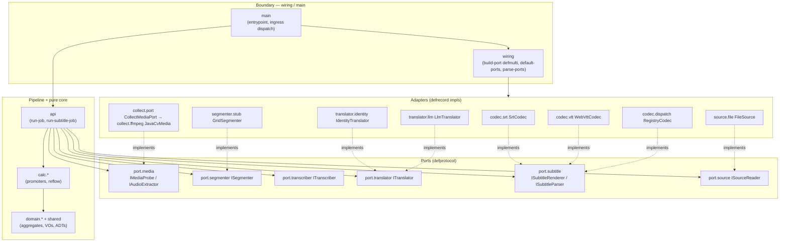

# vtranslate-engine — C4 Level 4 (Code)

A code-level view of the translation engine: the domain aggregates and value
objects, the ports (protocols), the adapters that implement them, the two ingress
pipelines, and how it all maps onto the CPPB strata. Everything below is drawn
from the source under `src/vtranslate/engine/`; nothing is invented.

The engine is hexagonal (ports/adapters), DDD (aggregates reference each other
BY ID, never embed), and rides a hive-dsl **Result railway** — fallible functions
return `(r/ok v)` / `(r/err :error/kw {data})` and compose with `r/let-ok`, so the
first error short-circuits to the caller. ADTs are `hive-dsl/defadt` closed sums;
`adt-case` gives compile-time exhaustiveness.

---

## 1. Dependency direction (DIP)

Adapters implement ports; the pipeline (`api`) depends on ports and on
`calc.*`/`domain.*` — never on a concrete adapter. `wiring` is the composition
seam that injects adapters into the pipeline at the boundary.



ASCII summary of the same rule:

```
    adapters  ───implements──▶  ports  ◀───uses───  api  ───uses──▶  calc / domain / shared
       ▲                                              ▲
       └──────────  wiring / main inject  ────────────┘
```

No adapter imports another adapter; no port imports an adapter; `domain.*` and
`calc.*` import nothing from ports or adapters. Only `wiring`/`main` know both
sides.

---

## 2. Shared kernel — value objects (`vtranslate.engine.shared`)

Bottom of the stratified stack: every bounded context may depend on it; it
depends on nothing above. Pure data + smart constructors, no effects.

| Record / def | Fields | Smart ctor | Err on invalid |
|---|---|---|---|
| `SourceRef` | `[uri]` | `make-source-ref` (non-blank string) | `:error/invalid-source` |
| `supported-languages` | closed set `#{"en" "pt-BR" "es" "fr" "de" "ja"}` | `make-language` (tag in set) | `:error/unsupported-language` |
| `Timecode` | `[ms]` (non-neg int) | `make-timecode` | `:error/invalid-timecode` |
| `TimeRange` | `[start end]` (Timecodes, `start <= end`) | `make-time-range` | `:error/inverted-time-range` |

`duration-ms` is a pure calc over a `TimeRange` (`end.ms - start.ms`).

---

## 3. Domain — the 5 aggregates

DDD: cross-aggregate references are BY ID (`asset-id`, `transcript-id`,
`source-id`, `subtitle-id`), never embedded. All time reuses the shared kernel.

### 3.1 MediaAsset — Ingestion (`domain.ingestion`)

The source artifact a job ingests + the probe facts the Collect layer fills in.

- **ADT `MediaKind`** (selects ingress path): `:media/video` · `:media/audio` · `:media/subtitle`
- **ADT `AssetStatus`** (lifecycle): `:asset/registered` → `:asset/probed` → `:asset/ready`; `:asset/rejected` terminal
- **VO `ProbeInfo`** `[container duration-ms has-audio? audio-codec]` — filled by Collect at the boundary
- **Aggregate root `MediaAsset`** `[id source-ref kind status probe]` (`source-ref` is a `shared/SourceRef`)
- Ctors / ops:
  - `make-media-asset {:id :source-uri :kind}` → wraps uri in `SourceRef`, status `:asset/registered`; `:error/unsupported-format` if kind unknown
  - `with-probe` → attach probe, `:asset/probed`
  - `ready` → video/audio need `:has-audio?`, subtitle always ready; else `:error/no-audio-stream`
  - `reject` → terminal `:asset/rejected`
  - `ingress-path` (`adt-case`, exhaustive): video→`:ingress/demux-asr`, audio→`:ingress/asr`, subtitle→`:ingress/parse`
  - `infer-kind` — boundary hint from filename extension; `subtitle-extensions #{"srt" "vtt" "ass"}` → `:media/subtitle`, else `:media/video`

### 3.2 TranslationJob — Job orchestration (`domain.job`)

The job aggregate root, its lifecycle, and the closed set of domain failures.

- **ADT `JobState`** (forward-only; `:job/failed` terminal): `:job/pending` → `:job/ingesting` → `:job/transcribing` → `:job/translating` → `:job/rendering` → `:job/completed`; `:job/failed`
- **ADT `TranslationError`** — closed set of domain failure modes; the variant kw doubles as the `r/err` category, the schema map documents the payload:
  - `:error/unsupported-format {:format}` · `:error/invalid-source {:source}` · `:error/source-unreadable {:source-uri}` · `:error/probe-failed {:reason}` · `:error/audio-extract-failed {:reason}` · `:error/no-audio-stream {:source-id}` · `:error/segmentation-failed {:reason}` · `:error/asr-failed {:reason}` · `:error/unsupported-language {:language}` · `:error/translation-failed {:segment-id :reason}` · `:error/render-failed {:reason}` · `:error/illegal-transition {:from}` · `:error/uncaught {:phase}`
- **Aggregate root `TranslationJob`** `[id asset-id target-language state transcript-id subtitle-id error]`
- Ctors / ops:
  - `make-translation-job {:id :asset-id :target-language}` → validates target-language, `:job/pending`
  - `fail` → terminal `:job/failed` carrying a `TranslationError` kw
  - `advance` → next happy-path phase (uses `forward-path`); `:error/illegal-transition {:from}` past the end
  - `complete` → jump directly to `:job/completed` (the no-ASR ingress skips `:job/transcribing`, so it cannot reach completed by repeated `advance`)
  - `link-transcript` / `link-subtitle` → record produced aggregate BY ID
  - `describe` (`adt-case`, exhaustive) → one-line phase label

### 3.3 Transcript — Transcription (`domain.transcription`)

Produced by ASR; owns ordered Segments + per-segment Confidence. References the MediaAsset by `:asset-id`.

- **ADT `TranscriptStatus`**: `:transcript/empty` · `:transcript/partial` · `:transcript/complete` · `:transcript/failed`
- **VO `Confidence`** `[score]` + `make-confidence` (number in `[0.0,1.0]`) → `:error/invalid-confidence`
- **Entity `Segment`** `[index range text confidence]` + `make-segment {:index :start-ms :end-ms :text :confidence}` (validates range + confidence)
- **Aggregate root `Transcript`** `[id asset-id language segments status]`
- Ctors / ops:
  - `make-transcript {:id :asset-id :language}` → empty, validates language
  - `add-segment` → append, status `:transcript/partial`
  - `complete` → seal; empty transcript → `:error/asr-failed {:reason "no segments produced"}`
  - `total-duration-ms` — sum of segment durations (calc over shared kernel)

### 3.4 TranslatedCues — Translation (`domain.translation`)

Turns a source Transcript into cues for ONE target language. References the Transcript by `:transcript-id`. Deliberately NOT shared with rendering.

- **ADT `TranslationStatus`**: `:translation/pending` · `:translation/translating` · `:translation/complete` · `:translation/failed`
- **VO `TranslationUnit`** `[range source-text target-text]` + `make-translation-unit {:start-ms :end-ms :source-text :target-text}`
- **Aggregate root `TranslatedCues`** `[id transcript-id source-language target-language units status]`
- Ctors / ops:
  - `make-translated-cues {:id :transcript-id :source-language :target-language}` → validates BOTH languages and forbids a no-op (`src = tgt` → `:error/translation-failed`)
  - `begin` → `:translation/translating`
  - `add-unit` → append a `TranslationUnit`
  - `complete` → seal once ≥1 unit; empty → `:error/translation-failed {:reason "no units translated"}`
  - `unit-count`

### 3.5 SubtitleTrack — Rendering (`domain.rendering`)

The final, format-ready subtitle artifact. Owns ordered Cues + a SubtitleFormat. References TranslatedCues by `:source-id`. Never touches IO.

- **ADT `SubtitleFormat`**: `:format/srt` · `:format/vtt` · `:format/ass`
- **ADT `TrackStatus`**: `:track/draft` · `:track/rendered` · `:track/failed`
- **Entity `Cue`** `[index range lines]` + `make-cue {:index :start-ms :end-ms :lines}` (1+ string lines, else `:error/render-failed`)
- **Aggregate root `SubtitleTrack`** `[id source-id language format cues status]`
- Ctors / ops:
  - `make-subtitle-track {:id :source-id :language :format}` → validates language + known format; unknown format → `:error/unsupported-format`
  - `add-cue` → append a validated Cue
  - `render` → seal once it has cues; empty → `:error/render-failed {:reason "no cues to render"}`
  - `extension` (`adt-case`, exhaustive): srt→`"srt"`, vtt→`"vtt"`, ass→`"ass"`

---

## 4. Ports (protocols) — the ISP barriers

Each protocol is the smallest sufficient interface; the engine depends only on
these, never on a concrete adapter (DIP). Methods return Results of plain
boundary DATA — no transport/native type crosses a barrier.

| Port ns | Protocol | Method → Result | Err |
|---|---|---|---|
| `port.media` | `IMediaProbe` | `(probe this uri)` → `ProbeInfo` | `:error/source-unreadable` / `:error/probe-failed` |
| `port.media` | `IAudioExtractor` | `(extract-audio this uri opts)` → opaque `audio-source` | `:error/source-unreadable` / `:error/audio-extract-failed` |
| `port.segmenter` | `ISegmenter` | `(segment this audio-source opts)` → `{:spans [{:start-ms :end-ms}...]}` | `:error/segmentation-failed` |
| `port.transcriber` | `ITranscriber` | `(transcribe this audio-source language opts)` → `{:segments [{:start-ms :end-ms :text :confidence}...]}` | `:error/asr-failed` |
| `port.translator` | `ITranslator` | `(translate-batch this texts src tgt opts)` → `[string...]` (1:1 with `texts`) | `:error/translation-failed` |
| `port.subtitle` | `ISubtitleRenderer` | `(render-bytes this track)` → wire-text string | `:error/render-failed` |
| `port.subtitle` | `ISubtitleParser` | `(parse this text format)` → `{:cues [{:index :start-ms :end-ms :lines}...]}` | `:error/unsupported-format` |
| `port.source` | `ISourceReader` | `(read-text this source-uri)` → text string | `:error/source-unreadable` |

`port.media` is the engine-facing, domain-shaped media port. It is distinct from
the **Collect-layer** `collect.protocols` (`IMediaProbe`/`IAudioExtractor`
returning raw backend maps) — see §6.

---

## 5. Adapters (defrecord implementations)

### Subtitle codecs (`adapters.codec.*`)
- **`SrtCodec`** (`codec.srt`) — pure SubRip text↔cue transform; implements both subtitle ports. `render-bytes` walks a `SubtitleTrack`; `parse` returns cue-maps only for `:format/srt` else `:error/unsupported-format`. Uses `,` fractional separator.
- **`WebVttCodec`** (`codec.vtt`) — WebVTT variant: `WEBVTT` header, `.` separator, optional cue identifiers + settings, skips NOTE/STYLE/REGION. `parse` gated on `:format/vtt`.
- **`RegistryCodec [registry]`** (`codec.dispatch`) — ONE adapter satisfying both subtitle ports by looking the per-format codec up in the registry and delegating. Selects by the track's `SubtitleFormat` (render) or the requested format (parse); `format-of` tolerates the defadt-wrapped value or a raw keyword. Adding a format = a registry entry (OCP). **Self-registers** `wiring/build-port :renderer` and `:subtitle-parser`.
- **`codec.registry`** — open `format→codec` map. `default-registry {:format/srt … :format/vtt …}`, `register` (pure assoc), `codec-for` → `:error/unsupported-format` on miss.
- **`codec.timecode`** — pure `ms->clock` / `clock->ms` (the one place wire timecodes meet integer ms; parse accepts either separator + optional hour).

### Segmenter (`adapters.segmenter.stub`)
- **`GridSegmenter [window-ms]`** — deterministic fixed-window grid cutter (no VAD/ML); the conformant stub. `grid-spans` tiles `[0, duration-ms)` into `window-ms` windows (final clamped). `make-segmenter` default window 5000ms. **Self-registers** `build-port :segmenter` (reads `:segment-window-ms`, default 5000).

### Translators (`adapters.translator.*`)
- **`IdentityTranslator`** (`translator.identity`) — passthrough; returns input texts unchanged (count+order preserved). The always-available degenerate terminus. **Self-registers** `resolve-translator :identity`.
- **`LlmTranslator [api-url model secret-env secret-pass]`** (`translator.llm`) — MT over any OpenAI-compatible `/chat/completions` endpoint. Asks the model for a JSON array 1:1 with the input and VALIDATES the length, failing LOUD (`:error/translation-failed`) on mismatch. Secret resolution: a configured `pass:` path wins over the env var; no key anywhere → loud error at run (never a silent passthrough). Empty input → `(r/ok [])`. `provider-defaults` for `:openrouter` + `:venice`. **Self-registers** `resolve-translator :openrouter` and `:venice`.

### Source reader (`adapters.source.file`)
- **`FileSource`** (`source.file`) — reads a local filesystem path into UTF-8 text; guarded `slurp` remaps any IO failure onto `:error/source-unreadable`. **Self-registers** `build-port :source`.

### Media / Collect (`collect.*`) — the ffmpeg adapter
- **`CollectMediaPort [backend]`** (`collect.port`) — anti-corruption bridge implementing engine-facing `port.media` by delegating to `collect.audio` over an injected Collect backend; `media-err` remaps `:collect/*` errors onto the `TranslationError` ADT; owns the boundary temp-WAV policy. **Self-registers** `build-port :media` (config `:media-backend` can inject a non-JavaCV backend).
- **`JavaCvMedia`** (`collect.ffmpeg`) — the ONLY ns importing a bytedeco type; in-process ffmpeg (FFmpegFrameGrabber/Recorder) implementing `collect.protocols`. Loaded only on the `:ffmpeg` classpath. Converts ffmpeg µs → integer ms at the boundary (via `collect.units/us->ms`).

---

## 6. The Collect layer (CPPB "Collect") in detail

`collect.port` bridges the engine-facing `port.media` down to a separate
Collect-internal DIP anchor so no bytedeco type ever leaks upward:

```
api.run-job          ──▶ port.media          (engine-facing port, domain-shaped ProbeInfo)
CollectMediaPort     ──▶ collect.audio       (orchestration sugar / railway)
collect.audio        ──▶ collect.protocols   (Collect DIP anchor, raw backend maps)
collect.ffmpeg/JavaCvMedia                    (driven adapter, bytedeco)
```

- **`collect.protocols`** — Collect DIP anchors `IMediaProbe`/`IAudioExtractor`; impls return raw maps (`{:container :duration-ms :has-audio? :audio-codec :sample-rate :channels}`) and may THROW.
- **`collect.audio`** — the sugar the pipeline calls: validates the path via `hive-system.fs`, drives an injected backend, projects raw maps onto domain `ProbeInfo` (`to-probe-info`), wraps effects in Results (`try-effect*`), and fans out multi-source work under `hive-weave.parallel/bounded-pmap` (`probe-all`). `default-audio-opts {:sample-rate 16000 :channels 1}`.
- **`collect.units`** — pure `us->ms` (round-to-nearest, negatives clamp to 0); testable without loading bytedeco.

---

## 7. Provider resolution (translator/transcriber selection)

Layered selection feeding `wiring/build-port :translator` / `:transcriber`:

- **L2 `providers.config`** — `resolve-routing` resolves WHICH provider is active as a typed map `{:transcriber kw|nil :translator kw}`. Precedence: job-spec `:config` > env (`VT_TRANSCRIBER`/`VT_TRANSLATOR`) > `~/.config/vtranslate/config.edn` `[:providers …]` > default. `:transcriber` has NO default (nil → router fails loud); `:translator` defaults to `:identity`.
- **L3 registries** — open multimethod factories; each adapter self-registers a method (OCP):
  - `providers.transcriber-registry/resolve-transcriber` — `:default` → `:error/unknown-transcriber` (fail loud, no fake).
  - `providers.translator-registry/resolve-translator` — `:default` → `:error/unknown-translator`.
- **L4 `providers.router`** — active-provider + fallback POLICY. `resolve-active-transcriber`: requested key first, then `transcriber-priority [:whisper-local :openai-whisper]`; exhausted → `:error/no-transcriber-available` (ASR NEVER falls back to a fake transcript). `resolve-active-translator`: requested first, then `translator-priority [:identity]` — MT may degrade to the passthrough terminus.

---

## 8. The two ingress pipelines (`vtranslate.engine.api`)

`api` is the Pipeline + Boundary of CPPB: it orchestrates one job end-to-end over
INJECTED ports (DIP), calling pure promoters (`calc.*`) to assemble the aggregates
and hitting effects only in the port calls. The whole flow is one `r/let-ok`
railway — the first `r/err` short-circuits to the caller.

### Ingress A — demux + ASR: `run-job` (ports `{:media :segmenter? :transcriber :translator :renderer}`)

```
make-media-asset ─▶ make-translation-job(:job/pending)
   ─▶ port.media/probe ─▶ ingestion/ready(with-probe)        [asset ─▶ :asset/ready]
   ─▶ job/advance (pending ─▶ ingesting)
   ─▶ port.media/extract-audio ─▶ audio
   ─▶ segment-audio (optional ISegmenter; nil ─▶ ASR-native) ─▶ spans
   ─▶ port.transcriber/transcribe ─▶ calc.transcription/build-transcript  [Transcript]
   ─▶ job/advance (ingesting ─▶ transcribing) ─▶ link-transcript
   ─▶ texts = (map :text segments)
   ─▶ port.translator/translate-batch ─▶ calc.translation/build-translated-cues [TranslatedCues]
   ─▶ job/advance (transcribing ─▶ translating)
   ─▶ calc.rendering/build-subtitle-track ─▶ [SubtitleTrack]
   ─▶ job/advance (translating ─▶ rendering)
   ─▶ port.subtitle/render-bytes ─▶ rendered
   ─▶ job/advance (rendering ─▶ completed) ─▶ link-subtitle
=> (r/ok {:job :transcript :translated :subtitle-track :rendered})
```
Spec defaults: `:asset-kind :media/video`, `:format :format/srt`. `segment-audio`
passes the probed `:duration-ms` to bound the cut.

### Ingress B — parse, no ASR: `run-subtitle-job` (ports `{:source :parser :translator :renderer}`)

```
make-media-asset(:media/subtitle) ─▶ make-translation-job
   ─▶ port.source/read-text ─▶ text
   ─▶ port.subtitle/parse ─▶ parsed cue-maps
   ─▶ (optional) calc.reflow/reflow (cutting phase B)
   ─▶ non-empty check (else :error/render-failed "no cues parsed from source")
   ─▶ calc.subtitle-out/cue-texts ─▶ texts
   ─▶ port.translator/translate-batch ─▶ targets
   ─▶ calc.subtitle-out/apply-translations ─▶ tcues   (fail-loud on count mismatch)
   ─▶ calc.subtitle-in/build-subtitle-track ─▶ [SubtitleTrack]
   ─▶ job/advance (pending ─▶ ingesting) ─▶ job/complete + link-subtitle
   ─▶ port.subtitle/render-bytes ─▶ rendered
=> (r/ok {:job :subtitle-track :rendered})
```
Spec defaults: `:format :format/srt`; `:reflow` optional (absent → cues pass
through 1:1). This ingress has no transcribing step, so it uses `job/complete`
rather than repeated `advance`.

### Boundary dispatch (`vtranslate.engine.main`)

`main` is the CLI-facing boundary (subprocess transport): reads one EDN spec
(argv[0] or stdin), best-effort `register-adapters!` (so the self-registering
`build-port` / `resolve-*` defmethods load — bytedeco `collect.port` is swallowed
if absent), then dispatches by **MediaKind**:

```
ingress-kind = (:asset-kind spec) or (ingestion/infer-kind (:source spec))
   :media/subtitle ─▶ wiring/parse-ports   ─▶ api/run-subtitle-job   (Ingress B)
   else            ─▶ wiring/default-ports ─▶ api/run-job            (Ingress A)
```

A top-level `r/guard Throwable` funnels every escaping throwable (native bytedeco
Errors, malformed EDN, temp-file IO) into `:error/uncaught {:phase :run}`, so the
subprocess always prints an EDN Result and exits 0 (ok) / 1 (err).

`wiring/build-port` is an OPEN `defmulti` (default → `:error/adapters-not-wired`);
`default-ports` assembles `{:media :segmenter :transcriber :translator :renderer}`,
`parse-ports` assembles `{:source :parser :translator :renderer}` (every port here
loads WITHOUT bytedeco — the first fully-runnable pipeline).

---

## 9. CPPB strata mapping

The engine is organized into the four CPPB strata (Collect / Promote / Pipeline /
Boundary):

| Stratum | Responsibility | Namespaces | External backbone |
|---|---|---|---|
| **Collect** | Pull raw facts/bytes across the IO edge; convert native units | `collect.protocols`, `collect.ffmpeg` (bytedeco), `collect.audio`, `collect.port`, `collect.units` | `hive-system.fs`, `hive-weave.parallel` |
| **Promote** | Pure lift of boundary DATA into domain aggregates; pure cutting/reflow | `calc.transcription`, `calc.translation`, `calc.rendering`, `calc.subtitle-in`, `calc.subtitle-out`, `calc.reflow` | — (pure) |
| **Pipeline** | Orchestrate one job over injected ports as a Result railway | `api` (`run-job`, `run-subtitle-job`) | hive-dsl Result |
| **Boundary** | Ports (protocol barriers), adapters (impls), composition/entrypoint, provider routing | `port.*`, `adapters.*`, `wiring`, `main`, `providers.*` | `hive-weave` (bounded concurrency in Collect), hive-di (provider config) |

Underlying all four: the **domain core** (`domain.*` + `shared`) — pure
aggregates, VOs, and ADTs that depend on nothing above them.

The promoters are the seam between Collect boundary data and the domain: each
`calc.*/build-*` takes plain maps produced by a port and folds them into an
aggregate via the domain smart constructors, assigning 1-based indices the
adapters do not (transcription, rendering, subtitle-in), and failing loud on any
count mismatch (translation, subtitle-out).
